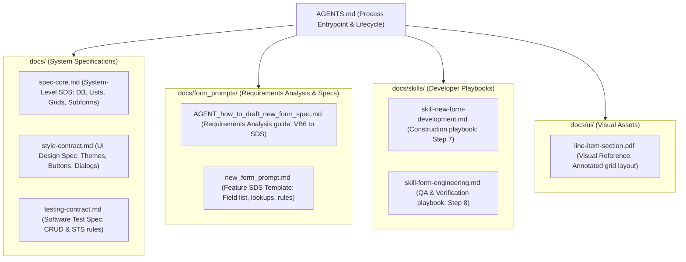
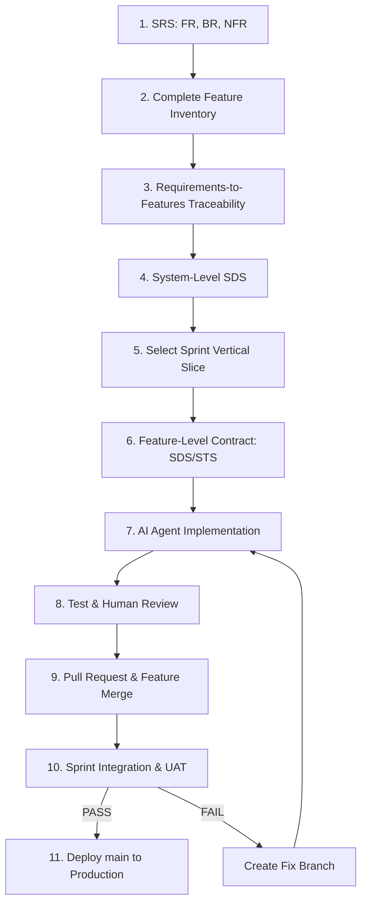

# SDD Engineering Contract Workflow for AI Developer Agents

This repository serves as a starter template and guide for teaching students Spec-Driven Development (SDD) with a rigorous engineering contract.

All path references in this document are relative to the root of your workspace: `{WORKSPACE_ROOT}`.

---

## 1. Documentation Directory & SDD Mapping

Below is the complete index of files in this repository, showing how each fits into the Spec-Driven Development (SDD) lifecycle:

| Relative Path | SDD Component / Stage | What the File Does |
| :--- | :--- | :--- |
| **`AGENTS.md`** | **Process Entrypoint & Lifecycle** | Defines the E2E lifecycle, work norms, and agent orchestration. |
| **`docs/spec-core.md`** | **System-Level SDS** (Step 4) | System-level design spec (database rules, list default configs, and detail grids). |
| **`docs/style-contract.md`** | **UI Design Specification** (Step 4/6) | Short checklist gate for theme tokens, buttons, dialog styles, and validation styling. |
| **`docs/testing-contract.md`** | **Software Test Specification (STS)** (Step 6/8) | Verification test catalog defining CRUD test assertions and test authoring standards. |
| **`docs/skills/skill-new-form-development.md`** | **Construction playbook** (Step 7) | Guide for the Builder Agent when scaffolding a new form from a spec. |
| **`docs/skills/skill-form-engineering.md`** | **QA & Verification playbook** (Step 8) | Step-by-step checklist for testing, reviewing code, and preventing style drift. |
| **`docs/form_prompts/new_form_prompt.md`** | **Feature SDS Template** (Step 6) | Blank template for writing Feature-level specifications (columns, lookups, rules). |
| **`docs/form_prompts/AGENT_how_to_draft_new_form_spec.md`** | **Requirements Analysis guide** (Steps 1–3) | Explains how to parse legacy VB6 files and DB schemas to write the feature SDS. |
| **`docs/ui/line-item-section.pdf`** | **Visual Mock-up / Reference** | A visual design asset mapping out exactly how the line item grid must look. |

---

## 2. The 11-Step SDD & Engineering Contract Lifecycle

Students and agents must follow this structured process strictly.

### Phase 1: Planning & Design (Human / Spec Agent)
1. **SRS (Software Requirements Specification)**: Define Functional Requirements (FR), Business Rules (BR), and Non-Functional Requirements (NFR).
2. **Complete Feature Inventory**: Break the system down into concrete features (e.g., Feature-A, Feature-B, Feature-C).
3. **Requirements-to-Features Traceability**: Map every requirement to its corresponding feature (e.g., `FR-003` $\rightarrow$ `Feature-E`).
4. **System-Level SDS (Software Design Specification)**: Establish the architecture, tech stack, UI/styling standards, API/data conventions, security policies, and deployment pipeline.

### Phase 2: Sprint Scoping (Human-Led)
5. **Select the Sprint Vertical Slice**: Choose a bounded "Feature Bundle" to be implemented during the sprint.
6. **Feature-Level Engineering Contract**: For each feature in the bundle, document its specific **SDS** (UI/API/Data Schema Specs), **Acceptance Criteria**, and **STS** (Software Test Specification).

### Phase 3: Construction & Verification (Single Agent / Sub-Agents)
7. **AI Agent Implementation**: Implement one bounded Issue/feature-card at a time according to the SDS engineering contract.
   - *Agent Role*: The **Builder Agent** consumes the contract files and constructs/modifies code files.
8. **Test and Human Review**: Run the automated test suites, perform manual visual/interaction testing, and inspect Git diffs to correct defects.
   - *Sub-Agent Option*: A specialized **Style Auditor Sub-agent** or **Test Verification Sub-agent** can run in parallel to review the PR delta.
9. **Pull Request and Integration**: Create a feature branch, submit a PR, and merge into the Sprint staging branch (e.g., `sprint-1-staging`).

### Phase 4: Release & Deployment
10. **Sprint Integration, System Testing, and UAT**: Run full end-to-end (E2E) and regression tests on the staging branch.
    - **If PASS**: Create a PR from the staging branch into the `main` branch.
    - **If FAIL**: Create a fix branch off staging, update the SDS/STS if requirements changed, and repeat Steps 7–9.
11. **Per Release Deployment**: Deploy the `main` branch directly to production.

---

## 3. Agent Roles & Multi-Agent Delegation Options

While the workspace runs on a single-instruction template for easy observation, the pipeline is designed to easily plug in sub-agents:

* **Spec Auditor (Sub-Agent)**: Validates that the builder's code strictly honors [spec-core.md](file:///{WORKSPACE_ROOT}/docs/spec-core.md) and the local Feature SDS.
* **Style Auditor (Sub-Agent)**: Loads only [style-contract.md](file:///{WORKSPACE_ROOT}/docs/style-contract.md) and modified UI files to check styling variable compliance.
* **Test Authoring Sub-Agent**: Inspects the Feature SDS & STS to automatically generate or update test files under `/tests/`.

---

## 4. Developer Work Norms

* **Strict Closed-World Rule**: If a specification (SRS/SDS) is silent on a design choice, the agent MUST stop and ask the developer/student instead of fabricating assumptions.
* **Spec & Test-Driven (TDD)**: No feature is complete without a corresponding automated verification test. Automated assertions must trace directly back to the `BR`/`FR` IDs defined in the SRS.
* **Theme & Style Compliance**: Custom actions and controls must inherit theme-specific colors using predefined CSS variables instead of raw Bootstrap utility classes. Avoid the HTML `title` attribute; use `data-tooltip` for custom tooltips.
* **Blur Validation Rule**: Fields with invalid inputs during general data entry must clear/blank out on blur. Form-level validation messages are only triggered upon clicking the explicit Save/Submit button.
